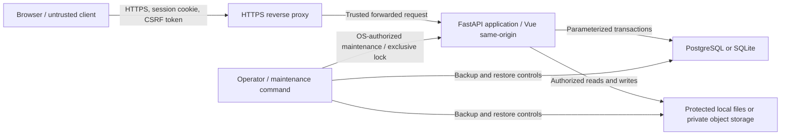

# Hosted DnD Notes threat model

Status: revised Milestone 0 baseline

Updated: 2026-07-25

## Scope

This threat model covers:

- local, hosted, development, and maintenance/recovery launch paths;
- local username/password login and administrator-controlled user admission;
- application sessions and CSRF protection;
- campaign membership and resource authorization;
- campaign assets and backup archives;
- system administration, deletion, and custody;
- PostgreSQL/SQLite persistence and object/local file storage; and
- multiple clients editing the same campaign.

The expected hosted deployment is a private, usually single-node Linux server.
The application, PostgreSQL, and protected filesystem storage may all run on
that server. It may be exposed through a public IP address or domain, but
internet-facing browser traffic terminates HTTPS before reaching the app.

## Security objectives

1. A hosted request reads or changes only data allowed by the authenticated
   identity, campaign role, resource policy, and explicit admin elevation.
2. Editing configuration cannot turn an initialized hosted installation into
   an unauthenticated application.
3. Passwords are never stored or logged; password hashes resist practical
   offline guessing after a database disclosure.
4. Authentication responses and timing do not unnecessarily reveal whether an
   account exists.
5. Knowing a campaign/resource/file ID or path does not grant access.
6. Member-private information does not leak through indirect APIs, exports, or
   metadata.
7. Account or campaign deletion is recoverable before deliberate purge.
8. Security-sensitive operations are attributable without logging secrets.
9. Concurrent clients cannot silently overwrite each other's mutations.

## Assets

- local user accounts, password hashes, account status, and admin roles;
- application sessions and CSRF state;
- activation, invitation, password-reset, signed-download, and recovery tokens;
- campaign membership and character assignments;
- shared, private, and restricted campaign records;
- uploaded images and generated exports;
- database and file-storage backups;
- deployment/session secrets and encryption keys;
- security audit events; and
- installation mode and identity.

## Actors

- anonymous internet client or automated scanner;
- authenticated user without campaign membership;
- viewer;
- member, including a malicious or compromised member;
- campaign owner, including a malicious or compromised owner;
- system administrator using normal membership or elevated access;
- deployment operator with database, file, or operating-system access;
- attacker with a copied database or backup;
- malicious backup/import file; and
- concurrent or stale application client.

## Trust boundaries

The browser is never trusted to state its user, role, campaign membership,
resource visibility, or deployment mode. A deployment operator can bypass
application authorization through direct server access; filesystem
permissions, restricted accounts, encryption, and operational procedure
control that risk.

## Threats, controls, and required evidence

### Credentials, identity, and admission

| Threat | Controls | Required evidence |
| --- | --- | --- |
| Database disclosure enables cheap password recovery | Maintained Argon2id library; unique salts; versioned/tunable parameters; password policy | Hash-format and parameter tests |
| Password or hash leaks through logs/config/export | Password accepted only through protected input; redaction; config/export schema excludes credentials | Log, artifact, and export audits |
| Online password guessing or credential stuffing | Account and source-aware throttling; increasing delay; bounded temporary lock; security events | Rate-limit and lockout tests |
| Response reveals a valid username | Generic login/reset response; substantially equivalent status and timing | Enumeration regression tests |
| Unknown user creates an account | No public registration; admin-created single-use activation | Direct-registration negative test |
| Stolen activation/reset/invitation token is reused | Random token stored as digest; expiry; single use; atomic consumption | Replay and concurrency tests |
| Bootstrap race creates unintended admins | OS-only command; exclusive lock; transaction; last-admin invariant | Concurrent bootstrap test |
| Reused username inherits a deleted identity | Internal tombstone retains the old user ID; reuse creates a separate account without old access or history | Delete then activation/login tests |
| Weak password reset bypasses authentication | Admin-issued or OS-assisted reset; no security questions; revoke sessions; audit | Reset authorization tests |

Password hashing and verification use a mature library rather than custom
cryptography. Parameters are calibrated for the deployment and may be upgraded
on successful login. Optional server-side peppering is deferred unless its
secret rotation and recovery lifecycle is designed and tested.

### Sessions and browser requests

| Threat | Controls | Required evidence |
| --- | --- | --- |
| Script reads application session | `HttpOnly`, `Secure`, explicit `SameSite` cookie; no token in local storage | Cookie/header integration test |
| Cross-site request mutates data | CSRF token on unsafe cookie-authenticated methods; strict origin/host settings | Cross-origin negative tests |
| Session remains after suspension, deletion, or password reset | Server-side sessions with revocation and account-state check | Revocation propagation test |
| Session fixation or excessive lifetime | Rotate after login/security changes; idle and absolute expiry | Rotation/expiry tests |
| Login return URL becomes open redirect | Allowlisted relative destination stored server-side | Malicious redirect tests |

### Campaign and resource authorization

| Threat | Controls | Required evidence |
| --- | --- | --- |
| IDOR reads another campaign/resource | Authorized campaign context; membership-filtered queries; `404` for non-member | Per-route actor matrix |
| Viewer/member calls owner operation directly | Named backend capabilities; no UI-only enforcement | Per-route actor matrix |
| Character parameter impersonates controller | Server resolves membership assignment; client user/role IDs ignored | Assignment mismatch tests |
| Inventory game owner becomes app owner | Separate schemas and policy vocabulary | Domain/access regression tests |
| New API route omits authorization | Every route declares auth classification; route-audit test fails closed | OpenAPI/route audit |
| Admin silently browses campaigns | Membership-only normal lists; reason-bearing elevation; audited outcome | Admin elevation tests |

### Privacy and inference

| Threat | Controls | Required evidence |
| --- | --- | --- |
| Hidden record appears in search/count/statistics | Resource policy in direct and aggregate queries | Privacy query suite |
| Tag/relationship reveals hidden target | Omit inaccessible structured reference and metadata | Cross-visibility tag tests |
| Image URL bypasses resource policy | Protected asset endpoint or authorized short-lived signed URL | Cross-campaign asset tests |
| Backup reveals another member's records | Requester-filtered user export; separate operational backup | Mixed-visibility export test |
| Change event reveals hidden data | Filter feed by current effective access | Multi-client privacy test |
| Error reveals whether hidden ID exists | Missing and inaccessible produce equivalent response | Response equivalence tests |

### Files, uploads, and imports

| Threat | Controls | Required evidence |
| --- | --- | --- |
| Path traversal reads/writes arbitrary file | Server-generated storage keys; safe path resolution; no client path | Traversal corpus tests |
| Fake/oversized image exhausts resources | Signature/type validation; bounded read; decode/dimension limits | Upload limit tests |
| ZIP bomb or unsafe archive member | Expanded-size/member limits; safe paths; bounded parsing | Malicious archive suite |
| Backup remains publicly reachable | Protected storage; streamed/expiring download; cleanup | Expiry/access test |
| Rollback leaves orphaned files | Transaction-owned file lifecycle and cleanup | Failure injection tests |
| Import restores foreign user grants | Versioned import; importer ownership; restricted grants normalize private | Cross-install import test |

### Configuration, administration, and recovery

| Threat | Controls | Required evidence |
| --- | --- | --- |
| Config edit changes hosted to local | Artifact/config/database agreement; persisted installation mode; fail closed | Restart mismatch test |
| Secret/default credential is embedded | Secret references; offline prompted bootstrap; artifact/config scan | Build/config audit |
| Raw HTTP exposes login/session | Hosted HTTPS public origin; secure cookies; reverse-proxy guidance | Production config test |
| Spoofed forwarded headers change origin/client | Explicit proxy trust and trusted hosts | Proxy-header tests |
| Recovery becomes a web backdoor | OS access; exclusive lock; loopback only; short-lived token; audit | Recovery concurrency tests |
| Admin abuses universal access | Explicit reason-bearing elevation and append-only security audit | Audit completeness test |
| Last owner deletion strands campaign | Multiple owners; transactional custodian transfer; orphan status | Deletion/custody tests |
| Last admin is removed | Prevent removal of last enabled login-capable admin; offline reset | Admin invariant test |

### Integrity, concurrency, and availability

| Threat | Controls | Required evidence |
| --- | --- | --- |
| Two clients silently overwrite data | Revision precondition; `409 Conflict`; conflict UI | Concurrent mutation tests |
| Expensive login/search/import causes denial of service | Endpoint limits; DB pool limits; bounded parsing; monitoring | Limit/load tests |
| Partial mutation corrupts aggregate | Single transaction owner; atomic admission/custody transitions | Failure injection tests |
| Database/file backup is unusable | Coordinated backups plus demonstrated restore drill | Recorded restore exercise |

## Required abuse cases

The hosted release must cover these with automated tests or a documented
operational control:

1. Anonymous caller enumerates usernames or campaign IDs.
2. Attacker repeatedly guesses one account or rotates usernames from one
   source.
3. Member changes the campaign banner or downloads an export.
4. Viewer issues a direct mutation request.
5. Member edits another member's assigned character.
6. Attacker reuses an activation, reset, invitation, or session token.
7. Two first-admin setup attempts run concurrently.
8. Deleted user attempts login and reactivation.
9. Sole owner deletes their account.
10. Admin reads a non-member campaign without an audit event.
11. Hosted config is changed to local after initialization.
12. Recovery starts while the hosted service is active.
13. Guessed asset or export URL is fetched by a non-member.
14. Malformed backup contains traversal paths or excessive expanded data.
15. Two members update the same note revision.
16. Private content leaks through a relationship, count, asset, export, or
    change event.

## Recovery and support expectations

### Lost password or administrator access

- A logged-in system administrator can issue a one-time reset for another
  user.
- A deployment operator can use the exclusive offline reset command when no
  administrator can log in.
- Password reset revokes existing sessions and records a security event.
- The application never reveals the old password and never falls back to open
  local mode.

### Accidental deletion

- Account deletion tombstones the user and transfers sole ownership to the
  custodian.
- Campaign deletion is soft during a configured recovery period.
- Permanent purge is deliberate, separately confirmed, and audited.

### Data recovery

- Hosted raw database files are not uploaded into the application.
- Existing local campaigns move to hosted mode through versioned import.
- PostgreSQL and filesystem/object storage have coordinated operational
  backups.
- A staging restore drill is required before closed beta.
- User-facing campaign export is not an infrastructure backup.

### Initial support level

Closed beta support is operator-assisted. Documentation must cover activation,
password reset, account restoration, ownership recovery, session revocation,
secret rotation, database/file restore, and security-event review.

## Explicit first-release non-goals

- public/self-service registration;
- email-based automated password reset;
- external or social identity providers;
- multi-factor authentication;
- organizations, billing, or enterprise tenancy above campaigns;
- public/anonymous campaign share links;
- custom campaign roles or per-field permissions;
- end-to-end encryption that prevents server/admin access;
- real-time collaborative text merging;
- offline-first hosted synchronization;
- active-active or multi-region deployment;
- portable cross-installation user grants; and
- final legal retention/erasure compliance for public launch.

These non-goals do not relax credential security, tenant isolation,
authorization, auditing, recoverability, or concurrency requirements.

## Residual risk

- A weak or reused user password may still be compromised despite hashing and
  throttling.
- A compromised system admin or deployment operator can access private data;
  DnD Notes is not end-to-end encrypted.
- A compromised home server can expose the database, stored files, and
  application secrets.
- Port forwarding and reverse-proxy/TLS mistakes can expose the service.
- An authorized member may damage shared resources within their capability
  until edit-history restoration exists.
- Denial of service can be reduced but not eliminated.

## Related decisions

- [ADR 0001: Deployment profiles, local identity, bootstrap, and recovery](../decisions/0001-deployment-identity-bootstrap-and-recovery.md)
- [ADR 0002: Campaign roles and capability matrix](../decisions/0002-campaign-roles-and-capabilities.md)
- [ADR 0003: System administration, deletion, and custody](../decisions/0003-system-administration-deletion-and-custody.md)
- [ADR 0004: Resource visibility and portable exports](../decisions/0004-resource-visibility-and-portable-exports.md)
